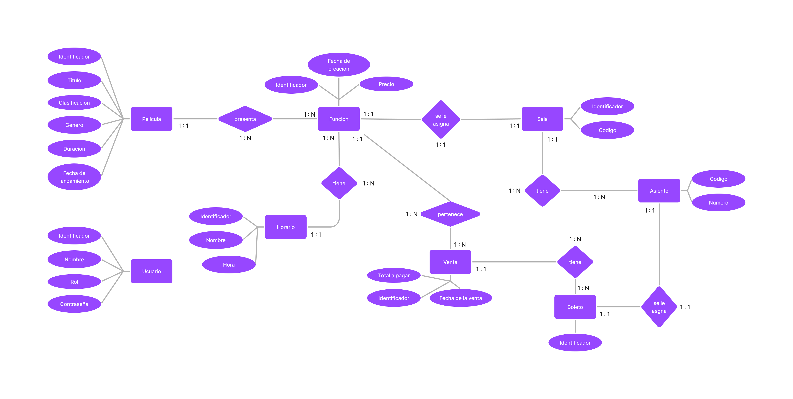
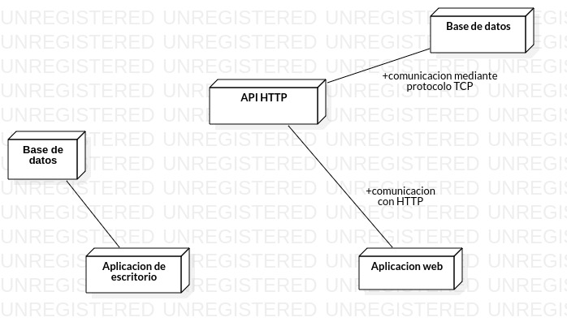

# Diseño del sistema de administracion de cine

En la etapa de diseño del sistema tocaremos los siguientes puntos:

- Modelacion de los datos del sistema.
- Comunicacion de los componentes del sistema.
- Diseño de las interfaces de usuario.

## Modelacion de los datos del sistema.

Gracias al analisis previo pudimos obtener detalles del tipo de informacion con la que trabajaremos en el sistema, ademas de ver como la informacion esta relacionado. Lo que se hara en esta seccion es extender lo que se hizo en el analisis, crearemos un diagrama de entidad-relacion y diagrama del modelo relacional.

### Entidades

En el analisis obtuvimos las siguientes entidades:

- Pelicula.
- Usuario.
- Sala.
- Asiento.
- Horario.
- Funcion.
- Venta.
- Boleto.

### Diagrama entidad relacion

## Comunicacion de los componentes del sistema

El sistema esta compuesto de:

- API HTTP.
- Bases de datos.
- Dos aplicaciones graficas.

A continuacion se muestra un diagrama en donde se ve como estos componentes se comunican.

## Diseño de las interfaces de usuario
