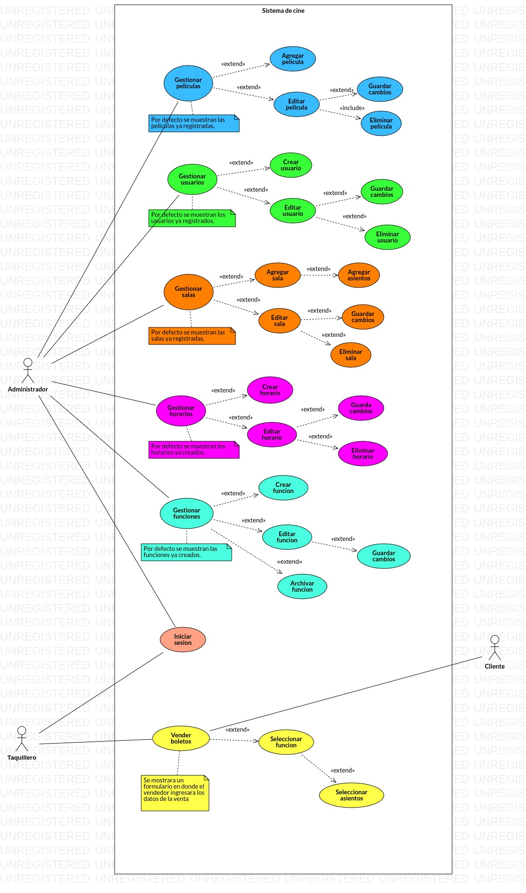
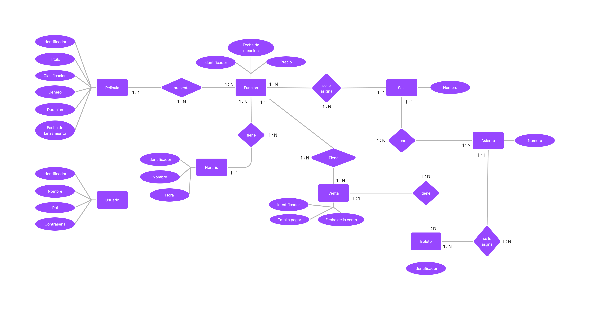
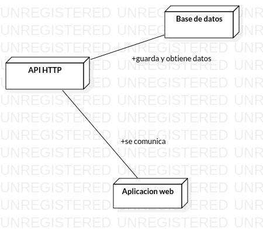

# Planteamiento

## Descripcion breve

En un cine pasan muchas cosas, asi que tener todo de forma ordenada es muy importante para el funcionamiento optimo de este.

Desde manejar las peliculas, las funciones disponibles, venta de boletos, asignacion de asientos. Todas estan son tareas que un sistema informatico puede ayudar a manejar.

## Objetivos

Nuestro objetivo con este proyecto es crear un sistema para manejar las diferentes necesidades de administracion de un cine, tales como:

- Manejo de las peliculas.
- Creacion de las funciones de peliculas.
- Asignacion de salas y asientos.
- Venta de boletos.

## Herramientas de manejo de proyectos

### Para llevar control de las tareas

Trello sera la herramienta que usaremos para llevar control de las tareas que cada miembro deba realizar.

Trello nos permite crear tareas, asignar fechas, niveles de prioridad y miembros a las tareas.

Asi tendremos una forma de ver como el proyecto progresa segun las asignaciones que se han completado y la cantidad de trabajo que los miembros del proyecto tiene.

## Tareas por hacer (tareas de planeacion)

- [x] usar Trello como administrador de tareas.
- [x] Asignar roles a cada miembro.
- [x] Realizar analisis del sistema.
- [x] Realizar fase de diseño del sistema.
- [x] Entrar a la etapa de implementacion.
- [] Realizar pruebas al sistema.
- [] Crear documentacion del sistema.
# Analisis del sistema de administracion de un cine

## Objetivos

### Generales

- Crear un sistema para controlar las necesidades administrativas de un cine.

### Especificos

- Identificar los aspectos de un cine que se quieren administrar.
- Identificar las funcionalidades del sistema.
- Crear descripciones para las funcionalidades del sistema.
- Definir el tipo de interaccion que tendran los usuarios con el sistema.
- Crear diagrama de casos de uso.
- Definir requisitos.
- Crear descripcion del sistema.

## Que cosas ocurren en un cine?

Podemos ver esto desde varias perspectivas, tales como:

- Un Cliente.
- Un Empleado.
- Un Administrador.

### Cliente

Un cliente va al cine, ve las peliculas disponibles, y si alguna de las peliculas le parece interesante, entonces comprara un boleta para verla.

### Empleado

A un empleado se le asigna diversos roles, por ejemplo, vendedor de boletos, o limpieza del cine.

En el caso de un vendedor, el se encarga de venderle boletos a los clientes que llegen al cine. A la hora de vender boletos, el vendedor necesita saber que peliculas estan disponibles, los asientos que estan disponibles, los precios de las entradas, etc.

### Administrador

Un administrador tiene mas responsabilidades, ya que el se encargara de que el cine este funcionando de forma eficiente y correcta, que los empleados esten realizando sus tareas, que las funciones de peliculas tengan los horarios correctos, etc.

### Resumen de lo que pasa en un cine

Un cliente llega al cine, ve las peliculas disponibles (en la cartelera), y si alguna le parece interesante, el comprara uno o mas boletos para verla.

Un empleado tiene varios roles, 1) puede ser un vendedor, el cual atiende a los clientes que desean comprar boletos, 2) puede ser del personal de limpieza.

Un administrador, se encarga de que todas las tareas que deban hacerse se hagan de forma correcta y en el tiempo esperado, un administrador es vital para que un cine funcione.

## Que aspectos del cine se quieren controlar en el sistema?

Que funcionalidades llevara un sistema?, hasta que nivel de detalle queremos controlar las cosas?, quienes usaran el sistema?

Todas estas son preguntas que debemos hacernos a la hora de analizar un sistema, ya que es esencial definir los limites de lo que se desea hacer. Bueno, pero quien decide que hacer y no hacer?

Podriamos tomar un enfoque que este _orientado a las necesidades_ de un cine, que cosas queremos controlar? porque controlarlas? Como controlarlas?

## Necesidades de un cine

Como se dijo anteriormente, a la hora de analizar un sistema, debemos poner limites. Para este sistema de cine hemos decidido enfocarnos en las siguientes necesidades administrativas:

- Control de peliculas.
- Control de los empleados.
- Control de las funciones cinematograficas.
- Control de las salas y asientos.
- Control de la venta de boletos.

### Control de peliculas

Llevar el control de las peliculas significa tener la informacion de las peliculas que se encuentran en los almacenes del cine en una base de datos, ademas de proveer una forma de trabajar con esta informacion, por ejemplo, ser capaz de modificar la informacion de las peliculas o agregar nuevas peliculas.

### Control de los empleados

Los empleados del cine seran los que interactuen con el sistema, asi que necesitamos llevar control de los usuario que participaran en el sistema y sus roles dentro del mismo.

### Control de las funciones cinematograficas

Una funcion cinematografica representa a una pelicula que esta disponible para ser vista, y a la cual se le asigna un horario, sala y precio.

El sistema sera capaz de llevar el control de las funciones cinematograficas.

### Control de las salas y asientos

Llevar el control de las salas significa que el sistema llevara el control de todas las salas con las que cuenta el cine. Tambien se llevara el control de los asientos de cada sala.

Hacer esto es necesario porque a cada funcion cinematografica se le asigna una sala, y al vender boletos, tambien se asignaran asientos.

### Control de la venta de boletos

Al tener funciones cinematograficas, luego necesitamos ser capaces de controlar la venta de boletos de dichas funciones, esto involucra saber las funciones disponibles, asientos disponibles y horarios.

## Interaccion de los usuarios con el sistema

Antes de hablar sobre las diferentes funcionalidades del sistema, primero hablaremos de como los usuarios interactuaran con el.

El sistema dispondra de dos aplicacion graficas:

- Una aplicacion web.

Los usuarios usaran la aplicacion web para interactuar con el sistema.

## Funcionalidades del sistema

Ahora que tenemos una vista clara de las cosas que pasan en un cine, es hora de definir las funcionalidades que el sistema tendra, y describir el propositio de cada funcionalidad.

### Gestionar peliculas

El sistema ofrecera una forma de gestionar las peliculas, esto, para ser mas exactos, significa que el sistema ofrecera una forma de llevar el control de la informacion de las peliculas.

Que informacion se almacena de las peliculas?

- Identificador.
- Titulo.
- Clasificacion.
- Genero.
- Duracion.
- Fecha de lanzamiento.

Que opciones tenemos cuando gestionamos peliculas?

- Agregar pelicula.
- Editar pelicula.
- Eliminar pelicula.

### Gestionar usuarios

En el sistema existen dos tipos de roles:

- Administrador.
- Taquillero.

El sistema ofrecera una forma de gestionar estos usuarios, y los roles asignados a ellos.

> Nota: Los administradores seran los unicos capaces de poder crear y modificar usuarios.

Que informacion se almacena de los usuarios?

- Identificador.
- Nombre.
- Rol.
- Contraseña.

Que opciones tenemos cuando gestionamos usuarios?

- Crear usuario.
- Editar usuario.
- Eliminar usuario.

El proposito principal de los usuarios es el de poder diferenciar a los usuarios que tienen acceso a todas las caracteristicas del sistemas (administrador), versus los usuarios que solo pueden vender boletos (taquillero).

El sistema tendra dos usuarios creados por defecto:

- Cuenta de administrador.
- Cuenta de taquillero.

### Gestionar salas y asientos

El sistema permite ingresar informacion de las salas del cine, ademas de los asientos con los que cuenta cada sala.

Llevar el control de esto es necesario porque a la hora de crear funciones cinematograficas, se le asignara una sala a una funcion.

Que informacion se almacena de las salas?

- Numero

Cada sala tiene asientos, y a la hora de vender boletos, los vendedores pueden elegir los asientos, asi que es necesario llevar el control de los asientos de las salas del cine.

Que informacion se almacena de los asientos?

- Numero.

A una asiento se le asigna:

- Una sala.

Restricciones a tomar en cuenta:

El numero de una sala es unico, asi que, el numero sera la llave primaria de una sala.

La llave primaria de un asiento sera una llave primaria compuesta entre el numero de asiento y el numero de sala.

Que opciones tenemos cuando gestionamos salas y asientos?

- Agregar sala.
- Editar sala.
- Eliminar sala.

> Nota: Al editar una sala, tambien seremos capaces de editar los asientos.

### Gestion de horarios

El sistema permitira gestionar horarios, los cuales seran asignados a funciones.

Que informacion se almacena de los horarios?

- Identificador.
- Nombre.
- Hora.

Que opciones tenemos cuando gestionamos horarios?

- Crear horario.
- Editar horario.
- Eliminar horario.

### Gestionar funciones cinematograficas

El sistema permitira gestionar funciones cinematograficas.

Que informacion se almacena de las funciones?

- Identificador.
- Fecha de creacion.
- Precio.

A una funcion se le asigna:

- Una pelicula.
- Un horario.
- Una sala.

Que opciones tenemos cuando gestionamos funciones?

- Crear funcion.
- Editar funcion.
- Archivar funcion.

Restricciones a tomar en cuenta:

Dos funciones no pueden tener la misma sala, a menos que los horarios sean diferentes, y dos funciones no pueden tener el mismo horario, a menos que las salas sean diferentes.

### Gestion de la venta de boletos

El sistema permite vender boletos para las funciones disponibles, un cliente puede comprar uno o mas boletos, el vendedor si lo desea puede preguntarle al cliente la ubicacion de los asientos, esta decision esta fuera de los alcanzes del sistema, asi que sera dejada a decision de la administracion del cine.

Que informacion se almacena de las ventas?

- Identificador.
- Fecha de la venta.
- Total a pagar.

A una venta se le asigna:

- Un funcion.

Ya que un cliente puede comprar uno o mas boletos, cada venta tiene asociada uno o mas boletos, asi que necesitamos llevar control de los boletos.

Que informacion se almacena de los boletos?

- Identificador.

A un boleto se le asigna:

- Una venta.
- Un asiento.
- Una sala.

Que opciones tenemos cuando gestionamos ventas?

- Seleccionar funcion.
- Seleccionar asientos.

## Diagramas de casos de uso

Los diagramas de caso de uso nos dejan ver de forma grafica a los actores y funcionalidades del sistema, y como estos interactuan.

## Requisitos

Los requisitos hacen referencia a las cosas que se necesitan implementar para que el sistema que se desea crear tome vida.

### Requisitos funcionales

- Las interfaz grafica del sistema era:

  - Una aplicacion web.

- Se implementaran las siguiente funcionalidades:

  - Control de peliculas.
  - Control de los empleados.
  - Control de las funciones cinematograficas.
  - Control de las salas y asientos.
  - Control de la venta de boletos.

- Se debe crear un sistema de autenticacion de usuarios, y asignacion de roles.

### Requisitos no funcionales

**API HTTP**

- Eficiencia:

- Aplicar optimizaciones a las consultas de la base de datos.

Documentacion:

- El sistema debe de contar con documentacion.

Seguridad:

- usar protocolos de comunicacion seguros, tales como, HTTPS.
- Las contraseñas deben ser pasadas por una funcion de hashing antes de ser guardadas a la base de datos.
- La funcion de hashing sera Bcrypt.

Herramientas de desarrollo:

- El sistema de manejo de base de datos sera PostgreSQL.
- El lenguaje de programacion para la API HTTP sera Go (Golang).
- GoFiber sera el framework de desarrollo web para crear la API HTTP.
- JSON sera el formato de texto para compartir informacion.
- Se usara la tecnica de sesiones para manejar las sesiones de los usuarios.

**Aplicaciones graficas**

Usabilidad:

- Asegurar que las aplicaciones seas responsivas a las interacciones del usuario en el menor tiempo posible.
- El sistema debe de proporcionar mensajes de error entendibles.
- Las interfaces de usuario deben de brindar una experiencia de usuario buena.

Documentacion:

- Se deben realizar capaciones a los empleados del cine.

Herramientas de desarrollo:

- ViteJS como herramienta de desarrollo para el proyecto.
- Lenguaje de programacion Typescript.
- ReactJS como libreria para crear la interfaz web.
- React Router para manejar enrutamiento del lado del cliente.
- StitchesJS para estilizar componentes.
- Radiux UI por sus componentes accesisibles.

## Descripcion del sistema

El sistema de administracion del cine proveera un conjunto de herramientas para facilitar la administracion de los siguientes aspectos:

- Gestion de peliculas.
- Gestion de usuarios (taquilleros y administradores).
- Gestion de salas, asientos y horarios.
- Creacion de funciones cinematograficas.
- Venta de boletos.

Para hacer uso de estas herramientas, el sistema ofrecera una aplicacion web.
# Diseño del sistema de administracion de cine

En la etapa de diseño del sistema tocaremos los siguientes puntos:

- Modelacion de los datos del sistema.
- Comunicacion de los componentes del sistema.
- Diseño de las interfaces de usuario.

## Modelacion de los datos del sistema.

Gracias al analisis previo pudimos obtener detalles del tipo de informacion con la que trabajaremos en el sistema, ademas de ver como la informacion esta relacionada. Lo que se hara en esta seccion es extender lo que se hizo en el analisis, crearemos un diagrama de entidad-relacion.

### Entidades

En el analisis obtuvimos las siguientes entidades:

- Pelicula.
- Usuario.
- Sala.
- Asiento.
- Horario.
- Funcion.
- Venta.
- Boleto.

### Diagrama entidad relacion

## Comunicacion de los componentes del sistema

El sistema esta compuesto de:

- API HTTP.
- Bases de datos.
- Aplicacion web.

A continuacion se muestra un diagrama en donde se ve como estos componentes se comunican.

## Diseño de las interfaces de usuario
# Roles

## Manager del proyecto

Se encarga de tomas los requerimientos, y en base a ellos digirir a los otros miembros del equipo para realizar el sistema propuesto. Esto se lograra creando tareas nuevas, asignandolas a miembros, y monitorear que estas tareas se completen en tiempo y forma.

## Analista

Analisa el sistema propuesto, establece objetivos, requisitos y descripciones. La meta del analista sera la de entender lo que se desea hacer, y descubrir cuales son las mejores formas de desarrollar el sistema deseado.

El analista tiene que hacerse uno con el sistema, sus funciones, el tipo de informacion del sistema, como estara compuesto el sistema, etc.

## Programador

Encargado de tomar las tareas asignadas por el _manager del proyecto_, y con sus conocimientos implementar las soluciones para dichas tareas.

El programador tiene un arsenal de herramientas para lograrlo, su principal arma: un lenguaje de programacion.

## Administrador de base de datos

sera el encargado de manejar los datos del sistema, esto lo hara usando sus conocimientos de base de datos, normalizacion, SQL, optimizaciones, etc.

## Diseñador UI

La persona encarga de crear las diferentes interfaces de usuario graficas del sistema. Es un rol muy importante, ya que existen principios que se deben seguir para crear interfaces amigables, accesibles, y faciles de usar.

## Asignacion de roles

- Manager del proyecto:

  - Edwin Garcia

- Analista:

  - Adriana
  - Edwin Garcia
  - Enmanuel Olivas
  - Ivan
  - Kenroy Norori

- Desarrollador Web:

  - Edwin Garcia

- Administrador de base de datos:

  - Edwin Garcia

- Diseñador UI:
  - Edwin Garcia
  - Kenroy Norori
